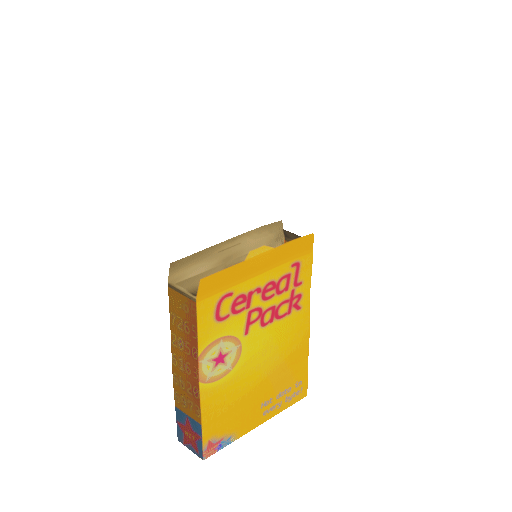

# Cereal Pack 🥣

#### C++ Schema Serialization Library



## What is Cereal Pack?

`cereal_pack` is a C++ 17 library that serializes structured data.

You bring the data definitions, and `cereal_pack` will generate C++ classes that can
`serialize` and `deserialize` themselves into a compact binary representation that
can be easily be transferred between processes.

## Getting Started
### Requirements
`python3` and the `toml` package for python
```
pip install toml
```

### Schemas
Schemas are defined by creating [TOML](https://toml.io/en/) documents.

Each provided `.toml` file will be converted into a C++ class that inherits from
`cereal_pack::Schema`.

The only required top level properties of a TOML schema are it's `name` and its
`props`.
* `name` should be a valid C++ class name
* `props` should be a dictionary of "propeties", where the dictionary key is the propety name

Here is a very simple example:
```toml
name = "OneBool"

[props]
    [props.boolean]
    type = "bool"
```

[More detail on schemas can be found here](./docs/SCHEMAS.md)

### Building
Once you have your schemas the process to generate your C++ classes is pretty
simple

#### Using CMake:
Add `cereal_pack` to your `CMakeLists.txt` as a `subdirectory`
and tell it where to find your `.toml` schemas, and where to place the generated
classes
```cmake
# Either set `CEREAL_PACK_SCHEMA_FILES` explicitly
set(CEREAL_PACK_SCHEMA_FILES
    "./my_schemas/schema_one.toml"
    "./my_schemas/schema_two.toml"
    )

# OR set `CEREAL_PACK_SCHEMA_DIR` which will recursively search the directory for .toml files
set(CEREAL_PACK_SCHEMA_DIR "./my-schemas")

# This will place the generated files in our build directory
set(CEREAL_PACK_OUTPUT_DIR "${CMAKE_CURRENT_BINARY_DIR}/my-schemas")

# add the `cereal_pack` subdirectory
add_subdirectory(${PATH_TO_CEREAL_PACK} cereal_pack_interface)
```
Then simply link `cereal_pack_interface` into your program
```cmake
target_link_libraries(my_program cereal_pack_interface)
```

The advantage of using cereal_pack's `CMakeLists.txt` is that any change to `cereal_pack`
or to your schemas will cause the generated C++ classes to be regenerated

[Check out the test suite CMakeLists.txt for another example](./test/CMakeLists.txt)

#### Manually:
First you need to use `cereal_pack.py` to generate the C++ classes
```sh
python cereal_pack.py -s ./my-schemas/* -o generated-classes/
```

Then simply include `cereal_pack` and the `generated-classes` in your build
```sh
g++ main.cpp -I./cereal_pack -I./generated-classes -o my_program
```

## Usage
### Generated C++ Schemas
The generated C++ schemas are more or less containers for lists of properties.
Each property on the class translates into a getter method which will return a
subclass of `cereal_pack::Property`.

For example, the schema generated by this TOML file
```toml
name = "Cereal"
[props]
    [props.is_cereal]
    type = "bool"

    [props.brand]
    type = "string"
    max_length = 32
```
Will have an `is_cereal` method that returns a `cereal_pack::Primitive<bool>`

All `cereal_pack::Property` classes are simple wrappers that allow you to `get`
or `set` the property.

Putting it all together:
```C++
Cereal c;
c.is_cereal().set(true);
std::cout << "Example is cereal?: " << e.is_cereal().get() << std::endl;
```

Most properties have pretty sensible implicit conversions & operators, so you
can also do things like this:

```C++
if (c.is_cereal() && e.brand() == "Honey nut cruncheyos") {
    eat();
}
```

#### Sets
Sets provide a few `std::vector` _like_ methods in addition to `get` and `set`
```C++
SetExample s;
s.set_of_things().push_back(a_thing);
s.set_of_things().emplace_back(another_thing);

assert(s.set_of_things()[0] == a_thing);
```

#### Nested schemas
The only property getter that won't return a `cereal_pack::Property` is the `reference`
type.

When using the `reference` property type to nest schemas, the generated getter
will return a reference to the referenced schema class

For example, with these schemas
```toml
name = "BoxDimensions"
[props]
    [props.size_x]
    type = "float"
    [props.size_y]
    type = "float"
    [props.size_z]
    type = "float"
```
```toml
name = "CerealBox"
[props]
    [props.dimensions]
    type = "reference"
    reference = "BoxDimensions"

    [props.brand]
    type = "string"
    max_length = 32
```

```C++
CerealBox box;
box.box_dimensions().size_x().set(3.14);
box.box_dimensions().size_y().set(1.66);
box.box_dimensions().size_z().set(4.1);
box.brand().set("Kollogs Quran Flakes");

// And if you want to set all the dimensions at once you can use the `=` operator
CerealBox same_size_box;
same_size_box.box_dimensions() = box.box_dimensions();
same_size_box.brand().set("Commander Crunch");
```

#### Serialization
You probably don't need it explained to you that you can `serialize` and `deserialize`
`cereal_pack` schemas.
```C++
CerealBox box;
// TODO: set some of the properties
uint32_t length_written = box.serialize(buffer);

// Some time later...
uint32_t length_read = another_box.deserialize(buffer);
```

#### Constants

All `cereal_pack` schema classes contain a `constants` "namespace" [^1]

[^1]: Actually C++ doesn't support namespaces inside a class, but a `struct` with
the constructor deleted does the trick

This will _always_ contain `schema_name` which will be the schema's class name (and namespace)
```c++
static constexpr const char * schema_name = "CerealBox";
```

And `max_serial_length`, which will indicate the maximum length the schema can
be when in serialized form
```c++
static constexpr size_t max_serial_length = 18;
```

In addition to this, it will contain any lengths that are defined as part of the
schema.

E.g. for this schema
```toml
namespace = "inventory"
name = "CerealStock"
[props]
    [props.barcodes]
    type = "set"
    max_items = 100
    item = { type = "const_length_buffer", length = 32 }

    [props.version_hash]
    type = "const_length_buffer"
    length = 16

    [props.signature]
    type = "dynamic_length_buffer"
    length = 72
```

The `constants` will look like this:
```C++
static constexpr const char * schema_name = "inventory::CerealStock";
static constexpr size_t max_serial_length = 3292;
static constexpr size_t barcodes_max_items = 100;
static constexpr size_t barcodes_item_max_length = 32;
static constexpr size_t version_hash_max_length = 16;
static constexpr size_t signature_max_length = 72;
```

And then using it:
```C++
using namespace inventory;
CerealStock stock;
load_stock(stock);

std::array<uint8_t, CerealStock::constants::signature_max_length> signature;
memcpy(stock.signature().get().data(), signature.data(), signature.size());

std::array<uint8_t, CerealStock::constants::barcodes_item_max_length> code;
scan_code(code);
bool in_stock = false;
for (auto& barcode: stock.barcodes().get()) {
    if (0 == memcmp(barcode.get(), code.data(), code.size())) {
        in_stock = true;
    }
}
```
### Globals
The generated code will _always_ include a file called `cereal_pack_globals.hpp`.

This will include the namespace `cereal_pack::globals`, containing constants &
definitions. By default the only thing in here will be `max_cereal_pack_serial_length`,
but you can add to this by supplying a global definitions file.

Globals can also be used to avoid repeating constant & enum definitions in multiple
schema files.

[More detail on globals can be found here](./docs/GLOBALS.md)

### Router
`cereal_pack` provides a router class that can be used to work with messages
created with `cereal_pack`. It is small and simple to use
```C++
using namespace cereal_pack::router;
BasicRouter<MyCustomHeader> r([] (const MyCustomHeader& h) { return h.body_name().get(); });

r.attatch_route<ImportantEvent>([](const ImportantEvent& event) {
    // TODO handle important event
});

r.attatch_route<UrgentEvent>([](const UrgentEvent& event) {
    // TODO handle urgent event
});

while (true) {
    std::vector<uint8_t> cereal_data = read_ipc();
    r.handle_message(cereal_data.data());
}
```
It's up to you to define how you want your message headers to look,
you just need to tell `cereal_pack` how to read your header.

[More detail on routers can be found here](./docs/ROUTER.md)

### Why would anyone want to use this over ProtoBuf?

They probably wouldn't! :)

Seriously, [ProtoBuf](https://developers.google.com/protocol-buffers) is a very mature, and well tested library with many more features, and it's developed by freaking _Google_.
`cereal_pack` is a hobby project made by one dude. There is no way it can compete
in terms of features, or stability.

However, if you need something _small & simple_, for C++ _only_, then maybe `cereal_pack`
can work for you. Due to a slightly simpler design `cereal_pack` has a handful of advantages

#### It's tiny & embedded friendly
* The core library that supports the generated C++ classes is very small (~60Kb compiled)

* It's header only, including the generated classes

* It integrates _very_ easily into `CMake` projects

* There is no "compiler", just some python scripts that generate the C++ classes

#### Max sizes
Every `cereal_pack` schema has a _maximum_ size when serialized. Having a determinate
amount of memory required makes code safer & simpler.

#### MIT License
This permissive license means you can take this library and build on top of it
however you like.

